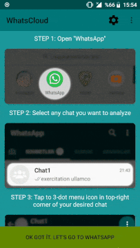

# WhatsCloud-Tracker

## Official WhatsCloud Project Page

We’re all using WhatsApp everyday and we are part of countless WhatsApp chat groups but Have you ever wondered statistical data about your chats like how many message sent so far? How many of them are mine? Which words are used at most? etc.

### Download (Google Play)
- https://play.google.com/store/apps/details?id=app.mordred.whatscloud

### Demo

### Tutorial/Demo Video:
- https://youtu.be/Tmb5MsqBRaU

WhatsCloud might help you find out by analyzing your WhatsApp chats on the fly with only one click. It’s a data analysis and visualization app which features:
- Analyze chat with each participants
- Graphical representaion of statistical data via charts and graphs
- Interactive graphs (zoom and pan)
- Most active chat participants
- Most commonly used words
- Most active days / weekdays
- Average message sending frequency
- etc.

### How is it working?
Although WhatsApp doesn’t give us a public API, it does allow users to export their chat history into a *.txt file.

WhatsCloud analyzes that user generated export of chat history on the fly and gives various graphical represantations of analyzed statistical data

There will be more features and different statistical data in the future, Feel free to send me an Email with the link provided in the bottom of this page if you have any ideas or send Go through
